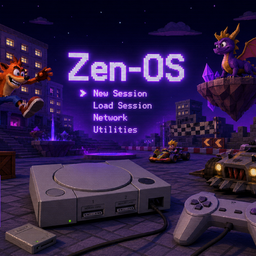

<p align="center">
  
</p>

<h1 align="center">ZEN-OS</h1>

<p align="center"><strong>Debian Trixie for gaming, engineering, development, and everyday desktop use.</strong></p>

<p align="center">
  <a href="https://zarigata.github.io/zen-os/">Website</a> ·
  <a href="USER_GUIDE.md">User Guide</a> ·
  <a href="BUILD.md">Build</a> ·
  <a href="ROADMAP.md">Roadmap</a> ·
  <a href="https://github.com/zarigata/zen-os/issues">Issues</a>
</p>

<p align="center">
  
  
  
  
  
</p>

---

## What ZEN-OS is

ZEN-OS is a Debian-based desktop distribution that tries to make one machine comfortable for **games, engineering work, software development, and normal daily use** without turning the system into a pile of post-install scripts.

The current build combines KDE Plasma, a Liquorix performance kernel, Steam/Wine/DXVK tooling, CAD/EDA/scientific software, broad firmware support, PipeWire, Flatpak, and secure-by-default networking.

> **Project status:** active prerelease/source-build project. The existing GitHub prerelease currently has no ISO asset attached, so the reliable way to try the newest tree is to build it from source. A tested downloadable ISO is a roadmap item before beta.

## Why it is different

| Area | What ships today |
|---|---|
| Desktop | KDE Plasma, Wayland + X11 fallback, custom ZEN-OS theme, Firefox ESR, Bluetooth, printing, KDE Connect |
| Gaming | Steam, Wine 32/64-bit, DXVK, MangoHud, GameMode, vkBasalt, GOverlay, Vulkan tools |
| Engineering | FreeCAD, LibreCAD, OpenSCAD, SolveSpace, KiCad, GNU Radio, Octave, Jupyter, Arduino/AVR tools |
| Development | GCC/Clang, Python, Node.js, Java, Rust, Docker, Podman, QEMU/libvirt, Wireshark |
| Hardware | AMD/Intel graphics stack, firmware collection, fwupd, hardware diagnostics |
| Security | UFW default-deny inbound, AppArmor, automatic Debian security updates, root locked, SSH off by default |
| ZEN-OS tools | Control Center, Security Center, Update Center, ZEN-OS Doctor diagnostics/support report |
| Audio | PipeWire + WirePlumber with low-latency desktop/gaming tuning |

### New: ZEN-OS Doctor

**ZEN-OS Doctor** checks the areas that most often break a Linux desktop:

- filesystem capacity and memory
- NetworkManager, UFW and AppArmor
- automatic security updates
- SSH exposure
- GPU/Vulkan initialization
- Steam, Wine, GameMode and MangoHud
- core desktop applications
- firmware visibility
- interrupted/broken dpkg state

It can save a plain-text support report to the user's home folder, making bug reports much easier to diagnose.

### New: ZEN-OS Update Center

The Update Center puts three maintenance paths in one place:

- Debian package refresh + full upgrade
- per-user Flatpak updates
- fwupd firmware checks/updates on supported hardware

Privilege escalation uses Polkit where administrative rights are required.

---

## Security model

ZEN-OS is a gaming/developer desktop, not a minimal hardened server, but it starts from conservative network defaults:

- unsolicited inbound traffic is blocked by UFW
- SSH is installed for developers but disabled until explicitly enabled
- SSH uses key authentication when enabled
- KDE Connect firewall access is opt-in
- AppArmor is enabled
- Debian security updates run automatically
- Debian fallback-kernel security updates remain allowed
- Wi-Fi scan MAC randomization is enabled
- root login is locked

Read [SECURITY.md](SECURITY.md) for the exact policy and trade-offs.

---

## Build it

The supported build path is Docker:

```bash
git clone https://github.com/zarigata/zen-os.git
cd zen-os
make build
```

The build fetches the pinned Liquorix packages, creates the Debian live-build environment, and produces:

```
live-image-amd64.hybrid.iso
```

Full instructions and troubleshooting are in [BUILD.md](BUILD.md).

### Validate before installing

Repository checks:

```bash
make test-all
```

Built-image checks:

```bash
make test-iso
```

`make test-iso` extracts and inspects the ISO, verifies the boot payload and squashfs, checks ZEN-OS tools are actually present, and inspects the package manifest when available.

For VM testing:

```bash
./scripts/test-vm.sh --web
# or
./scripts/test-vm.sh --docker
```

See [USER_GUIDE.md](USER_GUIDE.md) for first-boot and maintenance information.

---

## Build quality gates

Every pull request is checked for:

- live-build configuration syntax
- hook and shipped shell-script syntax
- broken ZEN-OS launcher targets
- duplicate package-list entries
- required OS metadata
- hardcoded personal paths
- Docker build-environment integrity
- **Debian Trixie package availability and simulated dependency resolution**

The package-resolution check is intentionally stricter than the old CI: it tests the packages intended for the ISO, not just whether `live-build` itself exists.

A full physical-hardware compatibility claim requires real-machine testing. See [ROADMAP.md](ROADMAP.md) for the planned hardware matrix.

---

## Software layout

```text
zen-os/
├── auto/                       live-build configuration entrypoints
├── config/
│   ├── hooks/live/             target-system configuration hooks
│   ├── includes.chroot/        files copied into the live/installed system
│   └── package-lists/          curated Debian package sets
├── scripts/
│   ├── build.sh                ISO build
│   ├── fetch-kernel.sh         pinned Liquorix fetcher
│   ├── package-preflight.sh    Debian package/dependency validation
│   ├── verify-iso.sh           static built-ISO inspection
│   ├── test-vm.sh              QEMU/noVNC launcher
│   └── smoke-test.sh           local VM smoke checks
├── docs/                       GitHub Pages website
├── mcp-server/                 optional AI-assisted build/test control
├── Dockerfile.build
├── Makefile
└── versions.lock
```

Custom desktop tools are shipped under `/usr/local/lib/zenos/` and exposed through KDE application launchers.

---

## Known limitations

ZEN-OS is still prerelease software. In particular:

- the current GitHub prerelease does not yet contain a downloadable ISO asset
- NVIDIA proprietary drivers are **not** preinstalled
- Secure Boot is disabled in the live-build configuration
- Gamescope is not currently shipped as a native package
- hardware-specific handheld power/fan tuning is not yet validated broadly
- the VM smoke tooling is useful but is not a substitute for testing AMD, Intel and NVIDIA machines
- a polished graphical installer/onboarding flow still needs broader validation

These are tracked as release-readiness work rather than hidden behind marketing claims.

---

## Contributing

Start with [CONTRIBUTING.md](CONTRIBUTING.md). High-value contributions include:

- real-hardware boot/install reports
- AMD/Intel/NVIDIA compatibility testing
- laptop suspend/resume and battery testing
- controller/handheld testing
- installer and recovery improvements
- translations
- documentation
- package regression fixes

Bug reports are especially useful when they include a **ZEN-OS Doctor** report.

---

## Project documents

- [User Guide](USER_GUIDE.md)
- [Build Guide](BUILD.md)
- [Roadmap](ROADMAP.md)
- [Security Policy](SECURITY.md)
- [Contributing](CONTRIBUTING.md)
- [Development History](HISTORY.md)

---

## License

The ZEN-OS build configuration and original project code are licensed under the repository's [LICENSE](LICENSE). Included Debian and third-party packages retain their own licenses.

<p align="center"><strong>Game. Build. Create. Diagnose. Improve.</strong></p>
